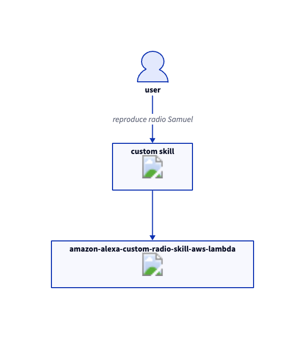
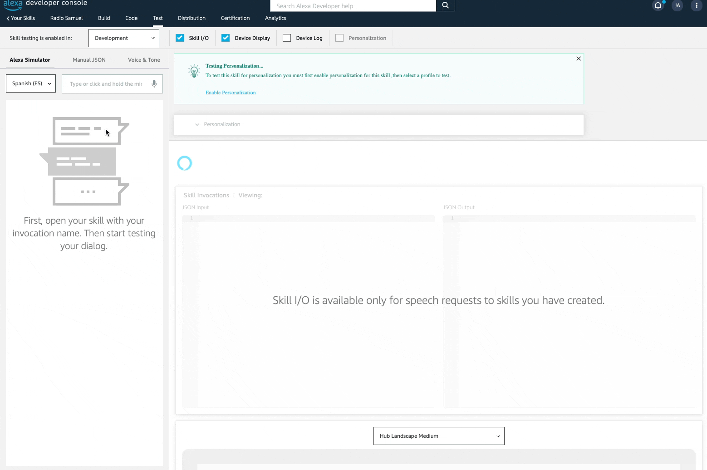

# amazon-alexa-custom-radio-skill

AWS Lambda Function to allow Alexa to play custom radio from streaming resources. 

This skill is configured to play `https://radiobahiagibraltar.es` but can be easily changed to play any other audio stream.


## Use Case



## Project Dependencies


#### Code Dependencies

1. Pyhton 3.8 or higher (we use python3.12)
2. python package ask-sdk-core==1.19.*
3. python package python-i18n==0.3.*

####  Deployment Dependencies

1. Pyhton 3.8 or higher (we use python3.12)
2. Docker
3. AWS-CDK cli
4. python package aws-cdk-lib==2.117.0
5. python package constructs>=10.0.0,<11.0.0

## How to deploy 

1. Install aws-cdk-cli (npm install -g aws-cdk)
2. Create a virtualenv (python3 -m venv .venv)
3. Activate virtualenv (source ./venv/bin/activate)
4. Install dependencies (python3 -m pip3 install -r requirements.txt)
5. Deploy (cdk deploy) 

<details>
<summary>Deployment Logs Example</summary>

```bash
❯ cdk deploy
Bundling asset amazon-alexa-construct/alexa-skill/Code/Stage...
Collecting ask-sdk-core==1.19.* (from -r requirements.txt (line 1))
  Obtaining dependency information for ask-sdk-core==1.19.* from https://files.pythonhosted.org/packages/d1/98/904d317ecda7a9284b90ceea93e9f0966b2e00a3d6521f5a44f398fc3a45/ask_sdk_core-1.19.0-py2.py3-none-any.whl.metadata
  Downloading ask_sdk_core-1.19.0-py2.py3-none-any.whl.metadata (8.5 kB)
Collecting python-i18n==0.3.* (from -r requirements.txt (line 2))
  Downloading python_i18n-0.3.9-py3-none-any.whl (13 kB)
Collecting requests (from ask-sdk-core==1.19.*->-r requirements.txt (line 1))
  Obtaining dependency information for requests from https://files.pythonhosted.org/packages/70/8e/0e2d847013cb52cd35b38c009bb167a1a26b2ce6cd6965bf26b47bc0bf44/requests-2.31.0-py3-none-any.whl.metadata
  Downloading requests-2.31.0-py3-none-any.whl.metadata (4.6 kB)
Collecting python-dateutil (from ask-sdk-core==1.19.*->-r requirements.txt (line 1))
  Downloading python_dateutil-2.8.2-py2.py3-none-any.whl (247 kB)
     ━━━━━━━━━━━━━━━━━━━━━━━━━━━━━━━━━━━━━━━ 247.7/247.7 kB 5.1 MB/s eta 0:00:00
Collecting ask-sdk-model>=1.0.0 (from ask-sdk-core==1.19.*->-r requirements.txt (line 1))
  Obtaining dependency information for ask-sdk-model>=1.0.0 from https://files.pythonhosted.org/packages/d8/60/e7afbc08ade3ce526db61c727f4bd648d13813e96fdf7570bc7b09d91547/ask_sdk_model-1.82.0-py2.py3-none-any.whl.metadata
  Downloading ask_sdk_model-1.82.0-py2.py3-none-any.whl.metadata (16 kB)
Collecting ask-sdk-runtime>=1.15.0 (from ask-sdk-core==1.19.*->-r requirements.txt (line 1))
  Obtaining dependency information for ask-sdk-runtime>=1.15.0 from https://files.pythonhosted.org/packages/c4/a3/f23541fce7dc169a3795e4402270dcfe0dc1cf02f7450671bc28ba00af8c/ask_sdk_runtime-1.19.0-py2.py3-none-any.whl.metadata
  Downloading ask_sdk_runtime-1.19.0-py2.py3-none-any.whl.metadata (6.5 kB)
Collecting six>=1.10 (from ask-sdk-model>=1.0.0->ask-sdk-core==1.19.*->-r requirements.txt (line 1))
  Downloading six-1.16.0-py2.py3-none-any.whl (11 kB)
Collecting charset-normalizer<4,>=2 (from requests->ask-sdk-core==1.19.*->-r requirements.txt (line 1))
  Obtaining dependency information for charset-normalizer<4,>=2 from https://files.pythonhosted.org/packages/99/b0/9c365f6d79a9f0f3c379ddb40a256a67aa69c59609608fe7feb6235896e1/charset_normalizer-3.3.2-cp312-cp312-manylinux_2_17_aarch64.manylinux2014_aarch64.whl.metadata
  Downloading charset_normalizer-3.3.2-cp312-cp312-manylinux_2_17_aarch64.manylinux2014_aarch64.whl.metadata (33 kB)
Collecting idna<4,>=2.5 (from requests->ask-sdk-core==1.19.*->-r requirements.txt (line 1))
  Obtaining dependency information for idna<4,>=2.5 from https://files.pythonhosted.org/packages/c2/e7/a82b05cf63a603df6e68d59ae6a68bf5064484a0718ea5033660af4b54a9/idna-3.6-py3-none-any.whl.metadata
  Downloading idna-3.6-py3-none-any.whl.metadata (9.9 kB)
Collecting urllib3<3,>=1.21.1 (from requests->ask-sdk-core==1.19.*->-r requirements.txt (line 1))
  Obtaining dependency information for urllib3<3,>=1.21.1 from https://files.pythonhosted.org/packages/96/94/c31f58c7a7f470d5665935262ebd7455c7e4c7782eb525658d3dbf4b9403/urllib3-2.1.0-py3-none-any.whl.metadata
  Downloading urllib3-2.1.0-py3-none-any.whl.metadata (6.4 kB)
Collecting certifi>=2017.4.17 (from requests->ask-sdk-core==1.19.*->-r requirements.txt (line 1))
  Obtaining dependency information for certifi>=2017.4.17 from https://files.pythonhosted.org/packages/64/62/428ef076be88fa93716b576e4a01f919d25968913e817077a386fcbe4f42/certifi-2023.11.17-py3-none-any.whl.metadata
  Downloading certifi-2023.11.17-py3-none-any.whl.metadata (2.2 kB)
Downloading ask_sdk_core-1.19.0-py2.py3-none-any.whl (46 kB)
   ━━━━━━━━━━━━━━━━━━━━━━━━━━━━━━━━━━━━━━━━ 46.6/46.6 kB 91.2 MB/s eta 0:00:00
Downloading ask_sdk_model-1.82.0-py2.py3-none-any.whl (1.1 MB)
   ━━━━━━━━━━━━━━━━━━━━━━━━━━━━━━━━━━━━━━━━ 1.1/1.1 MB 28.8 MB/s eta 0:00:00
Downloading ask_sdk_runtime-1.19.0-py2.py3-none-any.whl (25 kB)
Downloading requests-2.31.0-py3-none-any.whl (62 kB)
   ━━━━━━━━━━━━━━━━━━━━━━━━━━━━━━━━━━━━━━━━ 62.6/62.6 kB 158.6 MB/s eta 0:00:00
Downloading certifi-2023.11.17-py3-none-any.whl (162 kB)
   ━━━━━━━━━━━━━━━━━━━━━━━━━━━━━━━━━━━━━━━ 162.5/162.5 kB 160.5 MB/s eta 0:00:00
Downloading charset_normalizer-3.3.2-cp312-cp312-manylinux_2_17_aarch64.manylinux2014_aarch64.whl (137 kB)
   ━━━━━━━━━━━━━━━━━━━━━━━━━━━━━━━━━━━━━━━ 137.3/137.3 kB 174.0 MB/s eta 0:00:00
Downloading idna-3.6-py3-none-any.whl (61 kB)
   ━━━━━━━━━━━━━━━━━━━━━━━━━━━━━━━━━━━━━━━━ 61.6/61.6 kB 76.7 MB/s eta 0:00:00
Downloading urllib3-2.1.0-py3-none-any.whl (104 kB)
   ━━━━━━━━━━━━━━━━━━━━━━━━━━━━━━━━━━━━━━━ 104.6/104.6 kB 191.0 MB/s eta 0:00:00
Installing collected packages: python-i18n, urllib3, six, idna, charset-normalizer, certifi, ask-sdk-runtime, requests, python-dateutil, ask-sdk-model, ask-sdk-core
ERROR: pip's dependency resolver does not currently take into account all the packages that are installed. This behaviour is the source of the following dependency conflicts.
botocore 1.31.72 requires urllib3<2.1,>=1.25.4; python_version >= "3.10", but you have urllib3 2.1.0 which is incompatible.
Successfully installed ask-sdk-core-1.19.0 ask-sdk-model-1.82.0 ask-sdk-runtime-1.19.0 certifi-2023.11.17 charset-normalizer-3.3.2 idna-3.6 python-dateutil-2.8.2 python-i18n-0.3.9 requests-2.31.0 six-1.16.0 urllib3-2.1.0

[notice] A new release of pip is available: 23.2.1 -> 23.3.2
[notice] To update, run: pip install --upgrade pip
Lambda Code Asset Size:  14M

✨  Synthesis time: 10.62s

amazon-alexa-construct:  start: Building 407d28eede92dc7ee04f581802233e2e503322eed0aae88affb5f02074f7a2a7:<AWS_ACCOUNT_ID>-eu-west-1
amazon-alexa-construct:  success: Built 407d28eede92dc7ee04f581802233e2e503322eed0aae88affb5f02074f7a2a7:<AWS_ACCOUNT_ID>-eu-west-1
amazon-alexa-construct:  start: Building 3d4142247cc9838695381c06dec84f1e4f4be9cb29be2431e7e3cb2916012616:<AWS_ACCOUNT_ID>-eu-west-1
amazon-alexa-construct:  success: Built 3d4142247cc9838695381c06dec84f1e4f4be9cb29be2431e7e3cb2916012616:<AWS_ACCOUNT_ID>-eu-west-1
amazon-alexa-construct:  start: Publishing 407d28eede92dc7ee04f581802233e2e503322eed0aae88affb5f02074f7a2a7:<AWS_ACCOUNT_ID>-eu-west-1
amazon-alexa-construct:  start: Publishing 3d4142247cc9838695381c06dec84f1e4f4be9cb29be2431e7e3cb2916012616:<AWS_ACCOUNT_ID>-eu-west-1
amazon-alexa-construct:  success: Published 3d4142247cc9838695381c06dec84f1e4f4be9cb29be2431e7e3cb2916012616:<AWS_ACCOUNT_ID>-eu-west-1
amazon-alexa-construct:  success: Published 407d28eede92dc7ee04f581802233e2e503322eed0aae88affb5f02074f7a2a7:<AWS_ACCOUNT_ID>-eu-west-1
amazon-alexa-construct: deploying... [1/1]
amazon-alexa-construct: creating CloudFormation changeset...

 ✅  amazon-alexa-construct

✨  Deployment time: 34.86s

Stack ARN:
arn:aws:cloudformation:eu-west-1:<AWS_ACCOUNT_ID>:stack/amazon-alexa-construct/df5d5dc0-a424-11ee-9ebd-06d5080f4119

✨  Total time: 45.48s

```

</details>


## Demo in Alexa Skill Builder Developer Console

